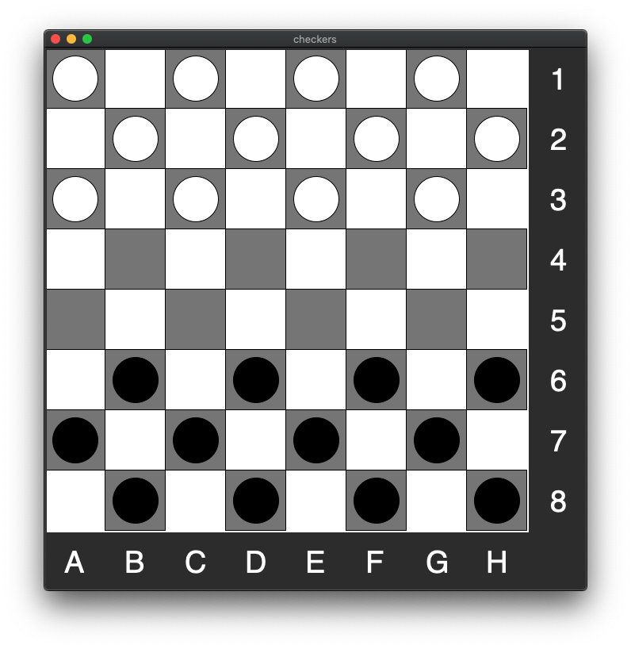
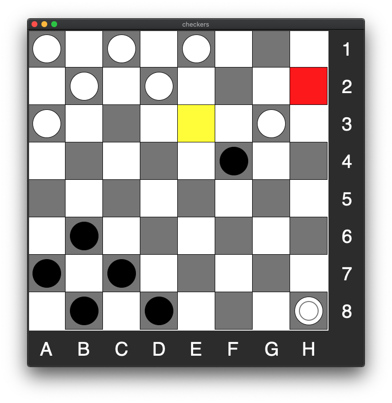
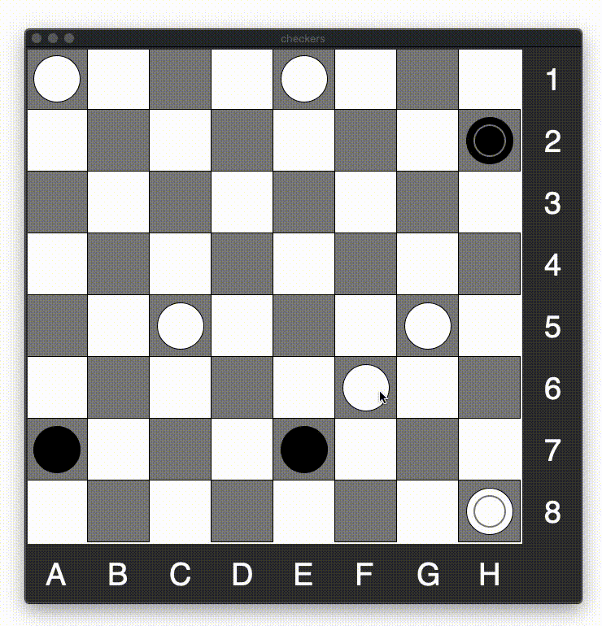

# Checkers

A game of checkers with a simple GUI made using *tkinter*. 

Execute main.py to play. Both human vs. human and human vs. computer options are available.

## Screenshots

Starting position.

It is black's turn. You must take a piece if you are able to.

Taking a piece and crowning in one move.

